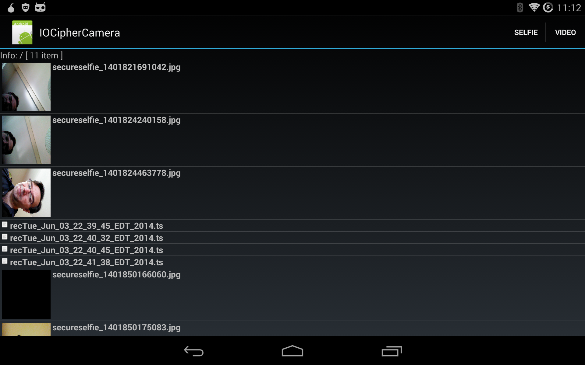

IOCipher Camera Example
================

This is an example app for the IOCipher framework, which provides encrypted virtual disks for Android. 

This example demonstrates how to capture a still photo (as an in memory byte[] array) directly from the Camera sensor, store that as an encrypted JPEG file directly inside of IOCipher, and then later share that file as a in-memory byte[] or a stream directly from a ContentProvider. It also handles recording video (without audio) into IOCipher using the MPEG_TS streaming video container format.

The example also provides two basic media viewer activities for photos and video. This provides an in-app mechanism for securely displaying media stored in IOCipher, without having to export the media to a file or share it with another app. These are very simple activities for now, but demonstrate the basic premise of how to extract and render media data from IOCipher. 

This example does not handle proper password/phrase management. Please see our CacheWord library at https://github.com/guardianproject/cacheword for help with that.

Please report bugs here:
https://dev.guardianproject.info/projects/iocipher/issues

Find out all about IOCipher here:
https://guardianproject.info/code/iocipher/

We'd like to hear from you if you have included IOCipher in your app!
support@guardianproject.info
